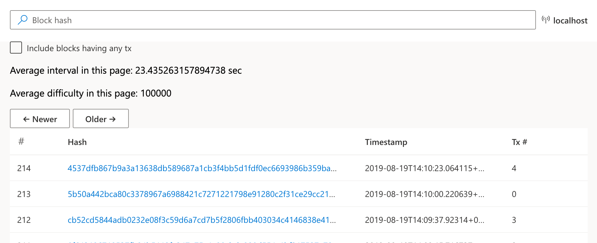
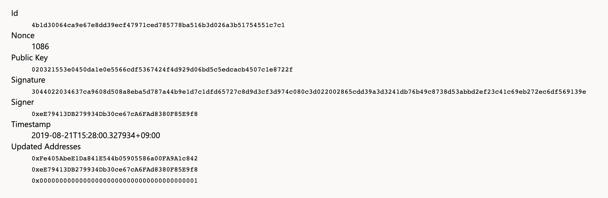

Hello, I'm Lee Dogeon, [Libplanet] committer at Planetarium!

This past August 15th and 16th, our team participated at [PyCon 2019 Sprint] as leader of Project [Libplanet]. In this article, I'd like to briefly talk about the contributions we received at PyCon Sprint.

[Pycon 2019 Sprint]: https://www.pycon.kr/program/sprint?lang=en-US

## Contributions at PyCon 2019 Sprint

Thanks to all our participants at the Sprint, many features were added to [Libplanet], as well as [Libplanet Explorer] and [Libplanet Explorer Frontend]!

[Libplanet Explorer] is a project that helps you search blocks created in games developed with Libplanet through [GraphQL], and [Libplanet Explorer Frontend] is a TypeScript + React project to make Libplanet Explorer easier to see in your browser.

The PyCon Organizing Team awarded us a balloon whenever we send a <abbr title="pull request">PR</abbr> and so I'd like to share some of the PR's that helped us receive a bunch of these balloons at the event!

[GraphQL]: https://graphql.org/

### Suspicious Activity in the Number of Blocks Downloaded

When a node (A) receives a query from another node (B) about a block’s content that the node (B) doesn't have, it (A) divides the block into a certain number and passes the block hash to the node (B) that sent the query.

But there was a problem in this process in which apart from the first response, the number of block hash received was one less than the expected amount. Contributor [Daehyun Paik][gurrpi] set off on a quest to solve this problem. 

And thanks to his contribution, we now can send and receive block hashes in the right amount.

[gurrpi]: https://github.com/gurrpi

### Hiding Empty Blocks!

[Libplanet] only accepts the longest chain as [Proof of Work][PoW], so it constantly creates blocks even if there aren’t any transaction. But when searching for transactions rather than the block itself, the query results are mixed with empty blocks, making the process quite cumbersome.

Since the blocks we're interested in are mainly those with transactions, contributor [Ha Hyemi][hyeguiee] added another option to Libplanet through her contribution!

Now we have an option to only see the blocks with transactions.

[PoW]: https://en.bitcoin.it/wiki/Proof_of_work
[hyeguiee]: https://github.com/hyeguiee

### Frontend Docking!

[Docker] is a tool that make it easy to create, deploy, and run applications using containers.

Contributor [Minho Ryang][minhoryang] helped us create a docker file for [Libplanet Explorer Frontend], providing us with an environment in which we can easily distribute Libplanet Explorer anywhere or run it locally.

[Docker]: https://docker.io/
[minhoryang]: https://github.com/minhoryang

### Frontend Changes!

Due to changes in [Libplanet Explorer] or for independent reasons, several features have been added to the frontend of Libplanet Explorer. 

Thanks to contributions by [Ahn Kiwook][AiOO], [Kang Hyojun][kanghyojun], and [aucch], we now have options to filter blocks without transactions and we can also show block creation times as well as average difficulty!

We now also have a separate transaction page to review details of each transaction!

[AiOO]: https://github.com/AiOO
[kanghyojun]: https://github.com/kanghyojun
[aucch]: https://github.com/aucch

## Contributions Are Always Welcome!

Sprint or not, questions or contributions to Project Libplanet are welcome any time! We invite you all to visit our [GitHub repository][libplanet] and leave comments on the issue or join [our Discord server] and ask us directly.

[our Discord server]: https://discord.gg/wUgwkYW

[Libplanet]: https://github.com/planetarium/libplanet
[Libplanet Explorer]: https://github.com/planetarium/libplanet-explorer
[Libplanet Explorer Frontend]: https://github.com/planetarium/libplanet-explorer-frontend

