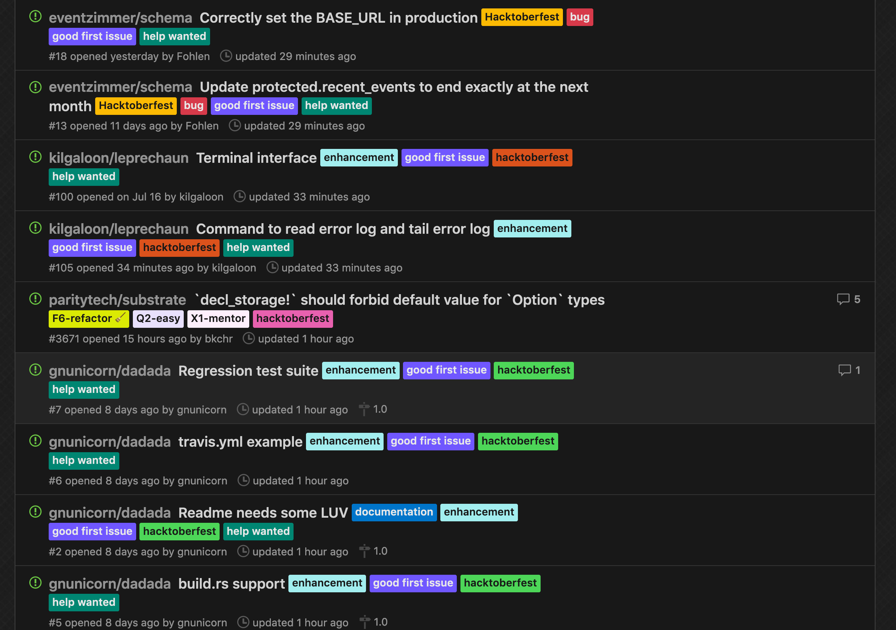

Greetings All! The month of Hacktoberfest has finally arrived.

Is this your first time hearing about <dfn>[Hacktoberfest]</dfn>? Hacktoberfest is an open source event that lasts for a month from October 1st to 31st. The event is open to everyone around the world and all you have to do is participate anytime within October and submit 4 pull requests to the Github Public Repository.

Send 4 pull requests and you'll get either a T-shirt or a sticker from the event host like DigitalOcean.

 And we’re happy to announce that Project [Libplanet] is also participating in the event this year!

So How Do We Get Started?
-------------------------

If you’d like to participate in Hacktoberfest, but just don’t know what to contribute to and send a pull request, you’re in luck. 

We’ve put up <q>*hacktoberfest*</q> labels on issues that are great for new contributors trying to participate in Hacktoberfest. So, you can pick the issues with the <q>hacktoberfest</q> label that you’d like to work on and leave a comment saying you're starting your work. Please take a look at the issues tracker of our projects—[Libplanet], [Libplanet Explorer], and [Libplanet Explorer Frontend].




Once you get started, you'll be talking to other open source contributors through comments and chat. If it’s your first time participating in an open source project, maintainers and other contributors will help so don’t worry.

For more information on goods and others, please visit the [Hacktoberfest Official Site][hacktoberfest].


Questions and Conversations
---------------------------

If you have any questions or difficulties while contributing to Hacktoberfest, we can certainly talk in the comments. But we hope you can come to our [Discord chatroom][1] where it’s much easier to communicate! And of course, you are always welcome well beyond Hacktoberfest.

[Libplanet]: https://github.com/planetarium/libplanet/issues?q=label:hacktoberfest+is:open+is:issue
[Libplanet Explorer]: https://github.com/planetarium/libplanet-explorer/issues?q=label:hacktoberfest+is:open+is:issue
[Libplanet Explorer Frontend]: https://github.com/planetarium/libplanet-explorer-frontend/issues?q=label:hacktoberfest+is:open+is:issue
[hacktoberfest]: https://hacktoberfest.digitalocean.com/
[1]: https://discord.gg/ue9fgc3
