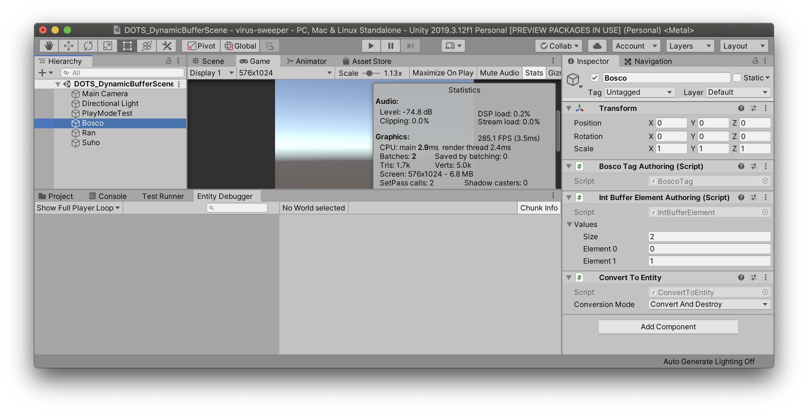
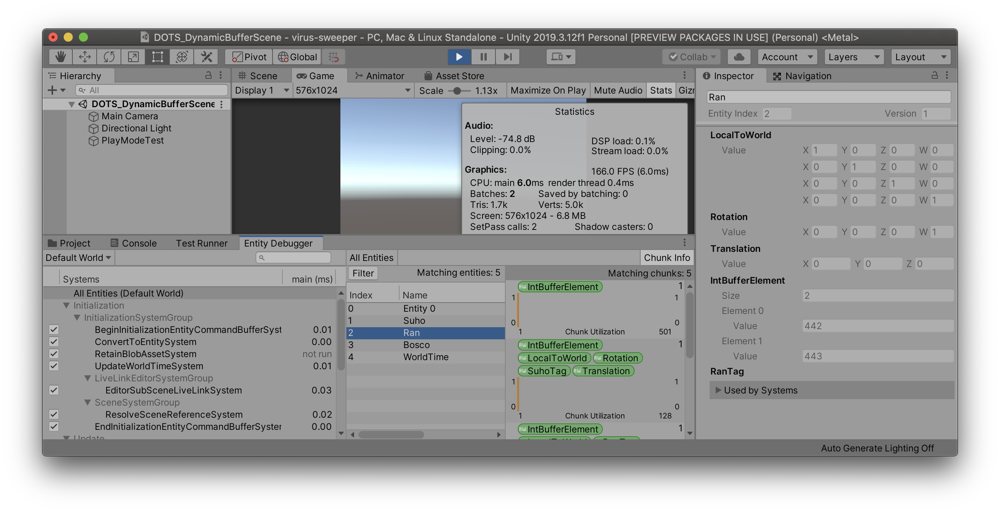
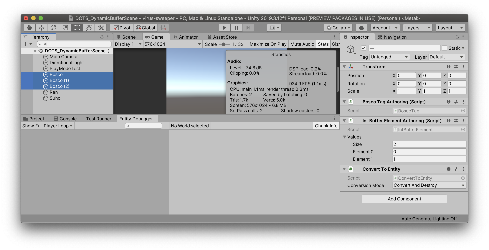
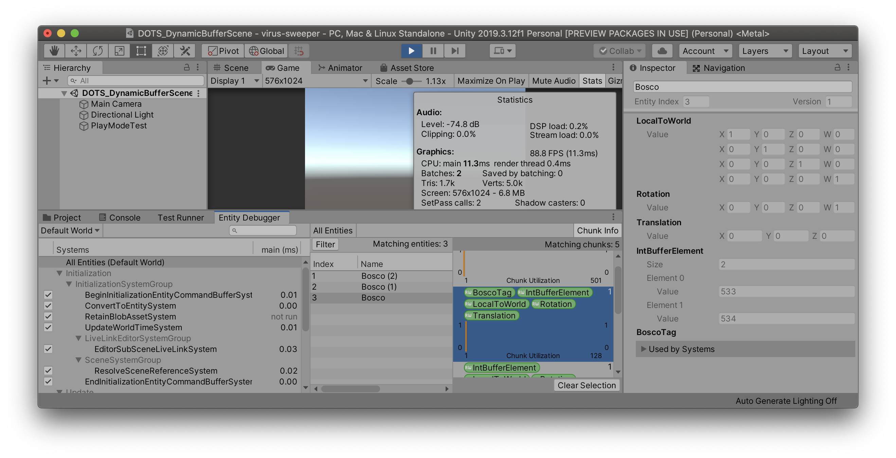

안녕하세요. [플라네타리움]에서 [나인 크로니클]을 개발하고 있는 현승민입니다. 해당 프로젝트는 아직 DOTS를 사용하고 있지 않지만, 차기작에 적용하기 위해 열심히 공부 중인데요. 앞으로 공부한 내용을 꾸준히 공유해보려고 해요.

이번에는 **DynamicBuffer**에 대해서 알아 볼게요. 엔티티에 동적 버퍼를 설정하고 이를 사용하는 방법에 대한 것인데요. DOTS와 관련한 첫 번째 글 치고는 몇 단계를 넘어 오기는 했지만 그 양이 적으니 관련한 내용을 함께 보시면 바로 이해하실 수 있을 것이라 생각해요.

이 글은 [유니티 문서][unity-document]와 [튜토리얼 영상][tutorial-video]을 참고했어요.

[플라네타리움]: https://planetariumhq.com
[나인 크로니클]: https://nine-chronicles.com

## 개발 환경

- 유니티: 2019.3.12f1

- com.unity.entities: 0.10.0-preview.6

## IBufferElementData 구현하기 [🔗](https://docs.unity3d.com/Packages/com.unity.entities@0.8/api/Unity.Entities.IBufferElementData.html)

엔티티에 더하는 컴포넌트는 **IComponentData**를 구현해야 하는 것과 마찬가지로 **DynamicBuffer** 또한 **IBufferElementData**를 구현해야 해요.

- **IBufferElementData**를 구현하는 **IntBufferElement** 구조체를 만들었어요. **IComponentData**와 같은 흐름이죠?

```cs
using Unity.Entities;

namespace Hoiys.DOTS_DynamicBuffer
{
  public struct IntBufferElement : IBufferElementData
  {
    public int Value;
  }
}
```

## EntityManager.AddBuffer\<T>(Entity) 사용하기 [🔗](https://docs.unity3d.com/Packages/com.unity.entities@0.8/api/Unity.Entities.EntityManager.html#Unity_Entities_EntityManager_AddBuffer__1_Unity_Entities_Entity_)

엔티티에 컴포넌트를 더하는 방법과 같이 **DynamicBuffer**를 더할 때도 **EntityManager**를 활용해요. 아래에서는 게임 오브젝트에 더해서 사용할 **PlayModeTest**라는 컴포넌트를 작성하고 플레이 모드에서 *Entity Debugger*를 확인해 볼게요.

- 엔티티에 **IntBufferElement** 버퍼를 더하고, 그 버퍼에 값을 좀 넣어 볼게요.

```cs
using UnityEngine;
using Unity.Entities;

namespace Hoiys.DOTS_DynamicBuffer
{
  public class PlayModeTest : MonoBehaviour
  {
    private void Awake()
    {
      var entityManager = World.DefaultGameObjectInjectionWorld.EntityManager;
      var entity = entityManager.CreateEntity();
      var dynamicBuffer = entityManager.AddBuffer<IntBufferElement>(entity);
      dynamicBuffer.Add(new IntBufferElement { Value = 1 });
      dynamicBuffer.Add(new IntBufferElement { Value = 2 });
      dynamicBuffer.Add(new IntBufferElement { Value = 3 });
    }
  }
}
```

- *DOTS_DynamicBufferScene*을 만들고 **PlayModeTest** 스트립트를 같은 이름의 게임 오브젝트에 추가했어요.


- 플레이 모드에서 _Entity Debugger_ 를 통해서 **PlayModeTest.Awake()** 함수에서 생성한 엔티티를 확인할 수 있어요. **IntBufferElement** 버퍼에 값이 세 개인 것이 보이시죠?


## DynamicBuffer\<Before>.Reinterpret\<After>() 사용하기 [🔗](https://docs.unity3d.com/Packages/com.unity.entities@0.8/api/Unity.Entities.DynamicBuffer-1.html#Unity_Entities_DynamicBuffer_1_Reinterpret__1)

버퍼에 담긴 구조체가 포함하는 값을 직접 수정하는 방법을 알아 볼게요.

- **PlayModeTest.Awake()** 함수를 조금 수정해서 재해석이라는 의미의 **Reinterpret\<T>()** API를 사용해 봤어요. 12번 줄에서와 같이 인덱스로 접근한 구조체는 변수로 분류되지 않는 임시값이기 때문에 변경할 수 없는데, 14-15번 줄에서와 같은 방법을 사용하면 값을 수정할 수 있어요.

```cs
private void Awake()
{
    var entityManager = World.DefaultGameObjectInjectionWorld.EntityManager;
    var entity = entityManager.CreateEntity();
    var dynamicBuffer = entityManager.AddBuffer<IntBufferElement>(entity);
    dynamicBuffer.Add(new IntBufferElement {Value = 1});
    dynamicBuffer.Add(new IntBufferElement {Value = 2});
    dynamicBuffer.Add(new IntBufferElement {Value = 3});

    // ERROR: Indexer access returns temporary value.
    // Cannot modify struct member when accessed struct is not classified as a variable
    // dynamicBuffer[0].Value *= 10;

    var intDynamicBuffer = dynamicBuffer.Reinterpret<int>();
    intDynamicBuffer[0] *= 10;
}
```

- 값이 바꼈는지 플레이 모드에서 확인해 볼게요. 잘 바꼈네요! 15번 줄에서 변경한 `intDynamicBuffer[0]`의 값을 `dynamicBuffer[0]`에 다시 넣지 않았는데 버퍼의 값이 바뀐 것이 중요한 점으로 보여요.


## EntityManager.GetBuffer\<T>(Entity) 사용하기 [🔗](https://docs.unity3d.com/Packages/com.unity.entities@0.8/api/Unity.Entities.EntityManager.html#Unity_Entities_EntityManager_GetBuffer__1_Unity_Entities_Entity_)

엔티티의 버퍼에 접근하는 방법도 필요하겠죠?

- **PlayModeTest**를 수정했어요. **Awake()**에서 생성한 엔티티와 이것에 추가한 버퍼를 **Start()** 에서 불러와서 값을 수정했어요.

```cs
public class PlayModeTest : MonoBehaviour
{
  private Entity _entity;

  private void Awake()
  {
    var entityManager = World.DefaultGameObjectInjectionWorld.EntityManager;
    _entity = entityManager.CreateEntity();

    var dynamicBuffer = entityManager.AddBuffer<IntBufferElement>(_entity);
    dynamicBuffer.Add(new IntBufferElement { Value = 1 });
    dynamicBuffer.Add(new IntBufferElement { Value = 2 });
    dynamicBuffer.Add(new IntBufferElement { Value = 3 });

    // ERROR: Indexer access returns temporary value.
    // Cannot modify struct member when accessed struct is not classified as a variable
    // dynamicBuffer[0].Value *= 10;
    var intDynamicBuffer = dynamicBuffer.Reinterpret<int>();
    intDynamicBuffer[0] *= 10;
  }

  private void Start()
  {
    var entityManger = World.DefaultGameObjectInjectionWorld.EntityManager;
    var dynamicBuffer = entityManger.GetBuffer<IntBufferElement>(_entity);
    var intDynamicBuffer = dynamicBuffer.Reinterpret<int>();
    for (var i = 0; i < intDynamicBuffer.Length; i++)
    {
      intDynamicBuffer[i]++;
    }
  }
}
```

- 잘 동작하는지 확인할게요. 버퍼 내의 모든 값이 1씩 증가한 것이 보이네요! 여전히 신기한 **Reinterpret\<T>()**.


## Authoing

[GenerateAuthoringComponentAttribute](https://docs.unity3d.com/Packages/com.unity.entities@0.8/api/Unity.Entities.GenerateAuthoringComponentAttribute.html) 를 적용하면 게임 오브젝트에 Authoring Component를 더해서 엔티티로 만들 수 있죠. **IBufferElementData**도 같은 방법을 사용할 수 있어요.

- **IntBufferElement**를 수정해서 **GenerateAuthoringComponentAttribute**를 적용할게요.

```cs
[GenerateAuthoringComponent]
public struct IntBufferElement : IBufferElementData
{
  public int Value;
}
```

- 그리고 Scene을 수정해서 자동으로 생성된 **IntBufferElementAuthoring** 컴포넌트를 게임 오브젝트에 더하고 값을 넣어 봤어요. 그리고 게임 오브젝트의 엔티티화를 위해서 **ConvertToEntity** 컴포넌트를 더했어요.


- *Entity Debugger*로 보면 **Authoring** 컴포넌트가 더해져 있던 게임 오브젝트와 같은 이름의 엔티티가 생성된 것을 확인할 수 있어요.


- 이후 과정을 위해 **BoscoTag**와 **RanTag**, **SuhoTag** 컴포넌트를 작성해서 각 컴포넌트를 포함하는 엔티티에 **IntBufferElement** 버퍼를 더해 볼게요.

```cs
using Unity.Entities;

namespace Hoiys.CommonTags
{
  [GenerateAuthoringComponent]
  public struct BoscoTag : IComponentData { }

  [GenerateAuthoringComponent]
  public struct RanTag : IComponentData { }

  [GenerateAuthoringComponent]
  public struct SuhoTag : IComponentData { }
}
```




## ComponentSystem에서 사용하기

**ComponentSystem**을 상속하는 시스템을 작성해서 **BoscoTag** 컴포넌트를 포함하는 엔티티의 **IntBufferElement DynamicBuffer**에 접근해 볼게요.

- **TestBufferFromEntitySystem**을 작성했어요. **BoscoTag**를 포함하는 엔티티들의 **IntBufferElement**형 **DynamicBuffer**에 접근해서 값을 변경하는 로직이에요. 20번 줄과 같이 사용하는 것은 안 되니 23-28번 줄과 같이 사용해요. 물론 **Reinterpret\<T>()**도 사용할 수 있겠죠?

```cs
using Hoiys.CommonTags;
using Unity.Entities;

namespace Hoiys.DOTS_DynamicBuffer
{
  public class TestBufferFromEntitySystem : ComponentSystem
  {
    protected override void OnUpdate()
    {
      var bufferFromEntity = GetBufferFromEntity<IntBufferElement>();
      Entities
        .WithAll<BoscoTag>()
        .ForEach(entity =>
        {
          if (bufferFromEntity.Exists(entity))
          {
            var dynamicBufferFromBoscoTag = bufferFromEntity[entity];
            foreach (var intBufferElement in dynamicBufferFromBoscoTag)
            {
              // Foreach iteration variable 'intBufferElement' is immutable.
              // Cannot modify struct member when accessed struct is not classified as a variable
              // intBufferElement.Value++;
            }

            for (var i = 0; i < dynamicBufferFromBoscoTag.Length; i++)
            {
              var intBufferElement = dynamicBufferFromBoscoTag[i];
              intBufferElement.Value++;
              dynamicBufferFromBoscoTag[i] = intBufferElement;
            }
          }
        });
    }
  }
}
```

- 플레이 모드에서 *Entity Debugger*를 보면 **BoscoTag** 컴포넌트를 포함하는 엔티티의 **IntBufferElement DynamicBuffer**의 값이 변하는 것을 확인할 수 있어요.


## JobComponentSystem에서 사용하기

**JobComponentSystem**을 상속하는 시스템을 작성해서 **RanTag** 컴포넌트를 포함하는 엔티티의 **IntBufferElement DynamicBuffer**에 접근해 볼게요.

- **TestBufferFromEntityJobSystem**을 작성했어요. **RanTag**를 포함하는 엔티티들의 **IntBufferElement**형 **DynamicBuffer**에 접근해서 값을 변경하는 로직이에요. 이번에는 **Reinterpret\<T>()**를 사용해 봤어요.

```cs
using Hoiys.CommonTags;
using Unity.Entities;
using Unity.Jobs;

namespace Hoiys.DOTS_DynamicBuffer
{
  public class TestBufferFromEntityJobSystem : JobComponentSystem
  {
    protected override JobHandle OnUpdate(JobHandle inputDeps)
    {
      return Entities
        .WithAll<RanTag>()
        .ForEach((ref DynamicBuffer<IntBufferElement> dynamicBuffer) =>
        {
          var intDynamicBuffer = dynamicBuffer.Reinterpret<int>();
          for (var i = 0; i < intDynamicBuffer.Length; i++)
          {
            intDynamicBuffer[i]++;
          }
        })
        .Schedule(inputDeps);
    }
  }
}
```

- 잘 동작하네요! 값이 쭉쭉 올라가고 있어요.



## Tips

### InternalBufferCapacityAttribute [🔗](https://docs.unity3d.com/Packages/com.unity.entities@0.8/api/Unity.Entities.InternalBufferCapacityAttribute.html)

엔티티는 기본적으로 청크에 포함되는데, **IBufferElementData** 를 구현하는 구조체에 **InternalBufferCapacityAttribute** 를 적용하면 청크 내 존재할 수 있는 최대 요소 수를 지정할 수 있어요. 지정한 요소 수를 넘어서면 해당 버퍼는 힙 메모리로 이동해요. 물론 이때에도 이전과 같이 **DynamicBuffer** API로 해당 버퍼에 접근할 수 있어요.

- 요소 수를 2개로 설정해 봤어요.

```cs
// InternalBufferCapacity specifies how many elements a buffer can have before
// the buffer storage is moved outside the chunk.
[InternalBufferCapacity(2)]
[GenerateAuthoringComponent]
public struct IntBufferElement : IBufferElementData
{
  public int Value;
}
```

- 그리고 같은 청크에서 테스트하기 위해서 BoscoTag를 포함하는 Bosco 게임 오브젝트를 두 개 더 복재했어요.



- *Entity Debugger*를 확인해 봤어요. 그런데 **IntBufferElement**가 여전히 청크에 남아 있는 것 처럼 보이네요. 힙 메모리로 이동됐어도 편의를 위해서 이렇게 보여주는 것인지는 확인이 필요하겠어요.



### Implicit operator

편의를 위해서 이렇게 작성해서 사용할 수도 있겠죠?

```cs
using Unity.Entities;

namespace Hoiys.DOTS_DynamicBuffer
{
  // InternalBufferCapacity specifies how many elements a buffer can have before
  // the buffer storage is moved outside the chunk.
  [InternalBufferCapacity(2)]
  [GenerateAuthoringComponent]
  public struct IntBufferElement : IBufferElementData
  {
    public int Value;

    // The following implicit conversions are optional, but can be convenient.
    public static implicit operator int(IntBufferElement e)

    {
      return e.Value;
    }

    public static implicit operator IntBufferElement(int e)

    {
      return new IntBufferElement { Value = e };
    }
  }
}
```

## 마치며

**IBufferElementData**와 **DynamicBuffer\<T>**를 가볍게 알아 봤어요.

게임을 만들 때 오브젝트 풀링에 대해서 수도 없이 많이 들어 보셨을 거예요. 1회용 객체를 생성하는 것은 쓰레기를 만드는 것이기에 풀링해서 재사용하면 Garbage Collecting을 줄이고 Instantiating 타이밍을 관리할 수 있어서 더욱 부드러운 게임을 만들 수 있죠.

다음에는 이 기능을 게임에 어떻게 적용하는지 알아보고, 적용하기 전과 후를 비교하면서 어느정도 효과를 얻을 수 있는지 확인해 볼게요.

[unity-document]: https://docs.unity3d.com/Packages/com.unity.entities@0.8/manual/dynamic_buffers.html
[tutorial-video]: https://www.youtube.com/watch?v=XC84bc95heI
