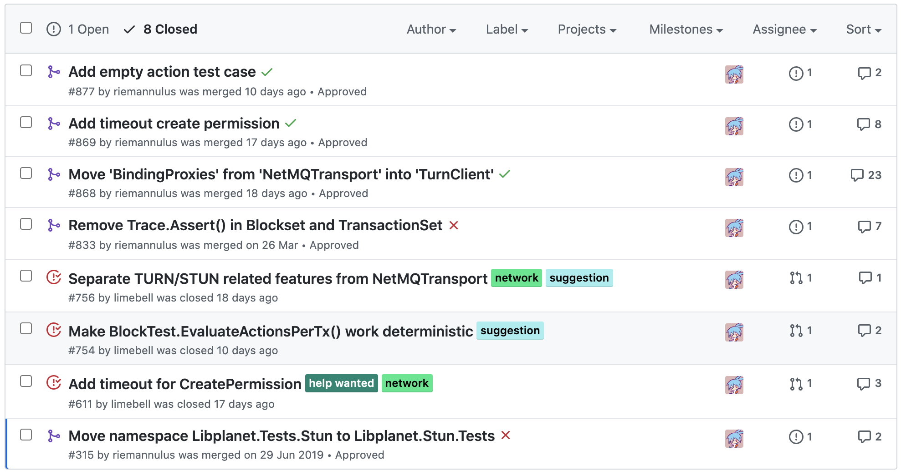
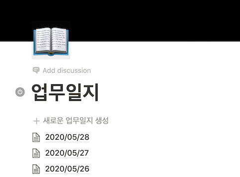
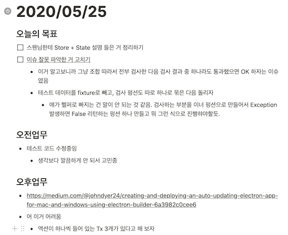

안녕하세요. 이번에 [플라네타리움]에 합류하게 된 이수호 입니다. 합류한 지 한달이 된 기념(?) 으로 제가 이 회사에 입사하고 어떤 기대를 하고 입사하였는지, 한 달동안 무엇을 했고 플라네타리움은 어떻게 일하는지 간단하게 소개해 보는 시간을 가지고자 합니다.

[플라네타리움]: https://planetariumhq.com/

입사 계기
-------

작년 6월경, <cite>[2019 스프린트 서울]</cite> 이라는 행사에 참여하게 되었습니다. 무슨 오픈소스에 기여할까 고민하던 저에게 당시 플라네타리움 팀원이셨던 홍민희님이 [libplanet]에 기여를 해 보면 어떻겠냐는 제안을 해 오셨습니다. 그렇게 즐겁게 기여를 마치고 나서 잊지 않고 있다가, 플라네타리움 구인 기간에 지원하여 입사하게 되었습니다. 이 곳이라면 내가 얻었던 즐거운 경험을 남들에게도 줄 수 있고, 나 자신도 그런 경험을 계속 쌓아나갈 수 있을 것이라고 판단하였기 때문입니다.

[2019 스프린트 서울]: https://www.sprintseoul.org/2019-06-29/
[libplanet]: https://docs.libplanet.io/0.9.2/index.html

한 달동안 한 것
------------
한 달동안은 기본적으로 libplanet의 구조와 C#에 대한 이해를 끌어올렸습니다. PoC 수준의 libplanet을 새로 작성해 보고, 각 모듈별 설명을 들을 때마다 그 모듈에 대한 이슈를 하나씩 제거해 나갔습니다.

개인적으로 매우 효과를 본 방법이라고 생각합니다. 설명을 들을 때는 높은 문맥의 이야기만 대부분 듣기 때문에, 이 높은 문맥에서 일어나는 일들이 낮은 문맥에서 어떻게 일어나는 지 직접 알아가며 체득하고, 실제로 문제를 해결하기 위해 분석하다 보니 이해도가 높았습니다.

또한 일일 업무일지를 저 개인적으로 적어나갔습니다.

  

  

이렇게 간단하게 독백하듯 막히는 것 적어놓는 습관을 들이게 된 이유는 바로 *'데일리 미팅'* 때문입니다.

미팅 문화
-------
플라네타리움 엔진팀은 엔진팀 자체에서 하는 미팅 종류가 총 3가지 있습니다.

- 데일리 미팅
- 주간 미팅
- 분기별 회고

이 중 *'데일리 미팅'* 은 간단하게 현재 하고있는 일을 오후 2시에 공유하는 미팅입니다. 보통 자기가 '집중 모드' 에 들어간 경우는, 누군가 깨 주거나 아이디어를 주기 전까지는 계속 오버 엔지니어링 혹은 흔히 말하는 삽질을 계속 하게 됩니다. 하지만 데일리 미팅을 진행하므로써 그것을 미연에 방지하고 서로의 일을 조금씩 도와 줄 수 있다는 장점이 있어 좋았습니다. 또한 저 개인적으로는 데일리용 업무일지를 적으면서 자기객관화가 쉽게 이루어져, 업무 자체에도 도움이 많이 되었습니다.

데일리는 많은 곳에서 진행하지만, 이걸 누구한테 인정받는 용도가 아닌 자기객관화를 하기 위한 용도라는 걸 인지하고 편하게 말하는 것임을 지키는 곳은 많이 없습니다. 하지만 플라네타리움은 데일리 미팅때 서로를 견제하거나 내가 하는 일을 부풀리는 게 아닌 자기가 막히고 있는 부분을 솔직하게 공유하고, 모르는 부분이 있으면 서로 물어보는 등 솔직하게 서로에게 정보를 공유하는 점이 매우 마음에 들었습니다.

짧은 실패를 경험해 가며 시도하는 회사
----------------------------
의사 결정에 있어 실패와 책임을 묻는 것은 아무 의미도 없다는 것을 임직원 모두가 너무나도 잘 알고 있습니다. 실패를 했을 경우 빠르게 공유하고, 피드백합니다. 그리고 대안책을 찾아 나갑니다. 비난보다는 격려를, 질책보다는 지향점을 이야기합니다.

그 외 장점
--------
개인적으로 느낀 다른 장점들은 다음과 같습니다.
- 리모트 근무
- (진짜) 수평적 의사결정
- 멋지고 뛰어난 사람들

마치며
----
이 글을 쓰고 있던 도중, 엔지니어링 워크샵에서 이런 발언이 나왔습니다.

> 우리 이름을 스낵이라고 지어 놓고, 너무 무거운 글들이 올라오는 거 아니에요? (웃음)

생각해보니 그렇습니다. 그래서 최대한 글 양을 줄이고 사진을 넣는 등 여러 시도를 해 보았는데 어떠셨을지 모르겠네요. 읽는 데 편안했었으면 좋겠습니다.

마지막으로 [libplanet]은 여러분의 기여를 언제나 기다리고 있습니다! 오픈 소스에 관심있는 분들은 저희 [디스코드 채널]에도 놀러오세요. 감사합니다!

[libplanet]: https://github.com/planetarium/libplanet
[디스코드 채널]: https://discord.gg/planetarium