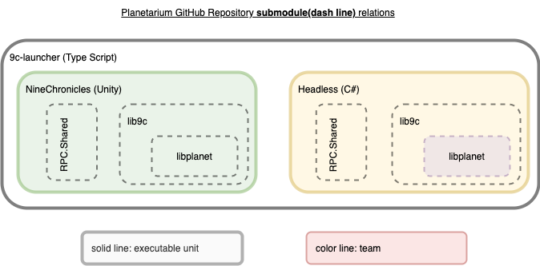
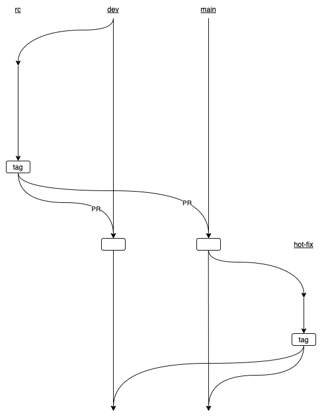
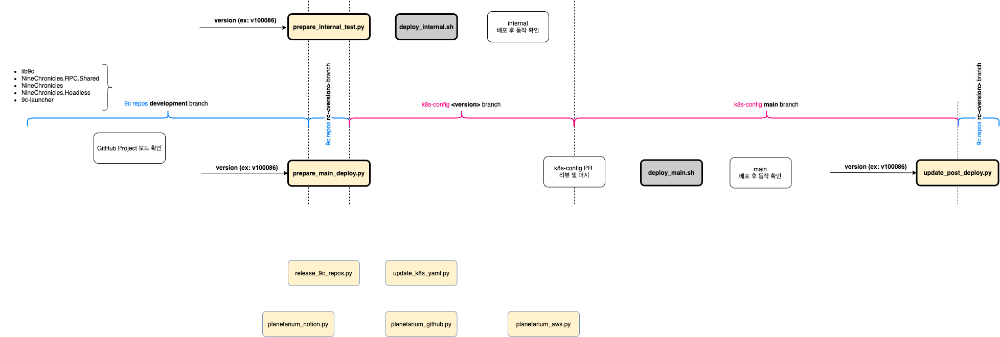
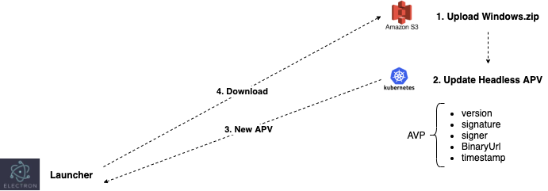

## Notion Release Page

Each version page in Notion's release notes table has the following attributes.

- RC/Target/Release Date
- App Protocol Version
- Release Candiate Commit Hash
    - 9c-launcher
    - NineChronicles
    - NineChronicles.Headless
    - NineChronicles.RPC.Shared
    - lib9c
    - libplanet
- QA Report
- ...

This must be filled in before deployment begins.

## GitHub Repository

Planetarium has several GitHub repositories.

- [9c-launcher](https://github.com/planetarium/9c-launcher)
- [NineChronicles](https://github.com/planetarium/NineChronicles)
- [NineChronicles.Headless](https://github.com/planetarium/NineChronicles.Headless)
- [NineChronicles.RPC.Shared](https://github.com/planetarium/NineChronicles.RPC.Shared)
- [lib9c](https://github.com/planetarium/lib9c)
- [libplanet](https://github.com/planetarium/libplanet)

It is included as a submodule as shown in the figure.

## Git Flow Branch Policy

We usually operate main and development branch, and PRs developed before release are merged only in development branch.

At the start of the release, create an rc-\<version\> branch in the development branch of each Planetarium repository.  
After completing the deployment in rc-branch, after tagging, the backmerge PR is sent to the main and development branches, and the deployment process is terminated.

In the case of hotfixes, only the repository that handles these fixes and backmerges in the main branch.

## Kubernetes Cluster

The k8s cluster has main and internal.
- main net (production)
- internal test net (development)

**Starting from Notion, tasks performed in multiple repositories of Planetarium are automated with the following script.**

1. prepare_internal_test.py

    - (Create rc-\<version\> from development branch of Planetarium repositories)
    - (Bump submodule of Planetarium repositories on rc-branch)
    - (Update notion page of release version)
    - (Create release version branch of k8s-config repository)
    - Generate a new APV for internal.
    - Update .yaml files for internal from notion page on release version branch
    - Build windows.zip with new APV for internal

2. deploy_internal.sh

    - Apply k8s manifest files for internal network

3. prepare_main_deploy.py

    - (Create rc-\<version\> from development branch of Planetarium repositories)
    - (Bump submodule of Planetarium repositories on rc-branch)
    - (Update notion page of release version)
    - (Create release version branch of k8s-config repository)
    - Update .yaml files for main from notion page on release version branch
    - Create pull request from release version branch to main branch

4. deploy_main.sh

    - Apply k8s manifest files for main network

5. update_post_deploy.py

    - Update https://download.nine-chronicles.com/apv.json
    - Update https://download.nine-chronicles.com/9c-launcher-config.json
    - Update https://download.nine-chronicles.com/latest/Windows.zip as \<version\>/Windows.zip
    - Invalidate CDN
    - Create tag on rc-\<version\> of Planetarium repositories
    - Create pull request from rc-\<version\> to main & development branch

## Update New Version

