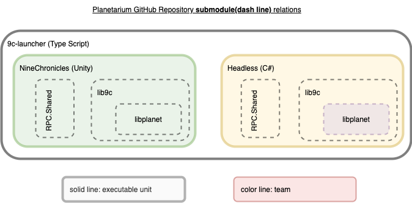
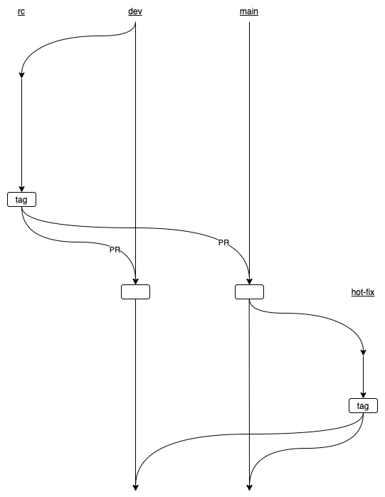
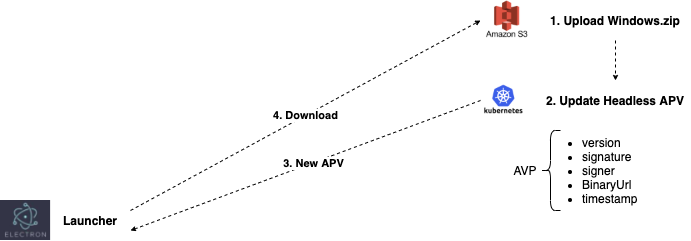

## Notion Release Page

노션의 릴리즈 노트 테이블의 각 버젼 페이지에는 다음과 같은 속성을 가지고 있습니다.

- RC/Target/Release Date
- App Protocol Version
- Release Candiate Commit Hash
    - 9c-launcher
    - NineChronicles
    - NineChronicles.Headless
    - NineChronicles.RPC.Shared
    - lib9c
    - libplanet
- QA Report
- ...

이 내용들은 배포 시작 전까지 모두 채워져 있어야 합니다.

## GitHub Repository

플라네타리움은 여러 개의 깃헙 저장소를 가지고 있습니다.

- [9c-launcher](https://github.com/planetarium/9c-launcher)
- [NineChronicles](https://github.com/planetarium/NineChronicles)
- [NineChronicles.Headless](https://github.com/planetarium/NineChronicles.Headless)
- [NineChronicles.RPC.Shared](https://github.com/planetarium/NineChronicles.RPC.Shared)
- [lib9c](https://github.com/planetarium/lib9c)
- [libplanet](https://github.com/planetarium/libplanet)

그림과 같이 submodule로 포함되어 있습니다.

## Git Flow Branch Policy

평상시 main과 development branch를 운영하고 있으며, 릴리즈 전에 개발되는 PR들은 development branch에만 머지됩니다.

릴리즈 시작 시 각 플라네타리움 저장소의 development branch에서 rc-\<version\> branch를 생성합니다.  
rc-branch에서 배포를 완료하고, tag 이후, 백머지 PR을 main과 development branch로 날리고 배포과정은 종료 됩니다.

핫픽스시에는 이를 처리하는 저장소에서만 main branch에서 수정후 백머지 합니다.

## Kubernetes Cluster

k8s cluster로 main과 internal이 있습니다.
- main net (production)
- internal test net (development)

**노션으로 부터 출발하여 플라네타리움 여러 저장소에서 수행하는 작업들은 다음의 스크립트로 자동화 됩니다.**

1. prepare_internal_test.py

    - (Create rc-\<version\> from development branch of Planetarium repositories)
    - (Bump submodule of Planetarium repositories on rc-branch)
    - (Update notion page of release version)
    - (Create release version branch of k8s-config repository)
    - Generate a new APV for internal.
    - Update .yaml files for internal from notion page on release version branch
    - Build windows.zip with new APV for internal

2. deploy_internal.sh

    - Apply k8s manifest files for internal network

3. prepare_main_deploy.py

    - (Create rc-\<version\> from development branch of Planetarium repositories)
    - (Bump submodule of Planetarium repositories on rc-branch)
    - (Update notion page of release version)
    - (Create release version branch of k8s-config repository)
    - Update .yaml files for main from notion page on release version branch
    - Create pull request from release version branch to main branch

4. deploy_main.sh

    - Apply k8s manifest files for main network

5. update_post_deploy.py

    - Update https://download.nine-chronicles.com/apv.json
    - Update https://download.nine-chronicles.com/9c-launcher-config.json
    - Update https://download.nine-chronicles.com/latest/Windows.zip as \<version\>/Windows.zip
    - Invalidate CDN
    - Create tag on rc-\<version\> of Planetarium repositories
    - Create pull request from rc-\<version\> to main & development branch

## Update New Version

