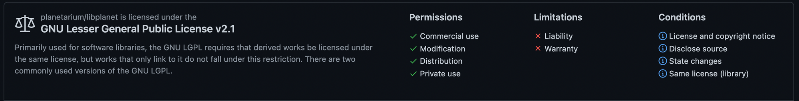

개발자 커리어와 오픈 소스는 떼려야 뗄 수 없는 관계입니다. 오픈소스를 통해 얻을 수 있는 것은 경력상의 혜택 뿐 아니라, 안전한 환경에서 새로운 기술을 배우며 효율적이고 효과적으로 의사소통하는 방법과 같은 소프트 스킬을 배울 수 있는 기술적 혜택, 그리고 이와 더불어 인맥적 혜택도 있습니다. 

플라네타리움의 핵심 기술인 립플래닛은 오픈 소스 입니다. 회사 업무를 병행하며 오픈 소스 기여를 하기란 쉽지 않은데, 립플래닛 개발 자체가 오픈 소스 기여가 되는 것이죠.

그래서 플라네타리움 구성원들 중에서는 오픈 소스 커뮤니티와 개발에 관심이 많았던 분들이 많습니다.

그럼 립플래닛을 통해 오픈 소스 프로젝트에 기여를 해볼까요? 물론 말처럼 쉽게 시작되진 않습니다. 그리고 시작 전에 알아야 할 몇가지 파일(README, CONTRIBUTING, LICENSE)들이 있습니다. 이 파일들을 통해서 립플래닛에 대해 소개하고 어떤게 립플래닛에 기여할 수 있는지 말씀드리고자 합니다. 

## 1. README 파일


립플래닛(Libplanet)은 탈중앙 방식으로 멀티플레이 온라인 게임을 만들기 위한 .NET 라이브러리입니다. 이는 전체 게임 플레이가 승인된 중앙 서버가 아닌 동일한 노드 사이의 P2P 네트워크에서 발생하는 것을 의미합니다. 내부적으로 블록체인의 많은 기능(예: 전자 서명, 비잔틴 장애 허용(BFT) 합의, 데이터 복제)을 통합합니다.

> 💡 **립플래닛을 써야하는 3가지 이유**
> <br><br>
> ***Embeddable***
> 게임 앱은 실행 중인 다른 프로세스와 통신할 필요가 없으므로 추가 [마샬링](https://ko.wikipedia.org/wiki/%EB%A7%88%EC%83%AC%EB%A7%81_(%EC%BB%B4%ED%93%A8%ED%84%B0_%EA%B3%BC%ED%95%99)) 또는 프로세스 관리가 필요하지 않습니다. Libplanet은 MySQL이나 PostgreSQL보다 [SQLite](https://ko.wikipedia.org/wiki/SQLite)에 더 가깝습니다.
> <br><br>
> ***Isomorphic***
> Libplanet은 .NET 라이브러리이므로 모든 게임 로직을 동일한 언어인 C#으로 작성하고 블록체인에서 실행할 수 있습니다. [글루 코드](https://en.wikipedia.org/wiki/Glue_code)나 "스마트 계약"이 필요하지 않습니다.
> <br><br>
> ***Token-independent***
> 거의 모든 블록체인 시스템과 달리 사용자가 또 다른 암호 화폐를 만들고 처리하도록 강요하지 않습니다. 당신의 게임은 무료로 플레이할 수 있으며 일반 게이머가 즐길 수 있습니다.

### 누겟(NuGet)

모든 안정적인 릴리스에 대해 Libplanet을 .nupkg로 압축하고 NuGet 및 GitHub 릴리스 페이지에 업로드합니다.

### 빌드(Build)

소스 코드에서 Libplanet.dll 및 Libplanet.Stun.dll 어셈블리를 빌드할 수 있습니다.

[libplanet/README.md at main · planetarium/libplanet](https://github.com/planetarium/libplanet/blob/main/README.md)

## 2. CONTRIBUTING 파일

### 기여자 가이드

참고: 현재 이 문서는 코드 기여자를 위한 것입니다.

### 질문 및 온라인 채팅

Libplanet에 대해 논의할 [Discord 서버](https://planetarium.dev/discord)가 있습니다. Libplanet 범주에는 다음과 같은 목적을 위한 몇 가지 채널이 있습니다. 여기 디스코드 내에서는 보통 한국어로 말하지만 자유롭게 영어로 말할 수 있습니다.

#libplanet-users: Libplanet을 사용하는 게임 프로그래머와 채팅하는 채널
#libplanet-dev: Libplanet을 해킹하고 패치를 만들기 위해 메인테이너 및 기여자에게 질문하고, 채팅하는 채널

### 전제 조건

최신 C# 컴파일러 및 .NET 런타임을 제공하는 .NET SDK 6.0 이상이 필요합니다. .NET 다운로드 페이지에서 .NET SDK 설치 지침을 읽고 따릅니다. 

선호하는 설정이 없는 경우 Visual Studio Code를 사용하는 것을 추천합니다. .NET을 만든 Microsoft에서 만든 무료 에디터입니다. 

### 빌드

다음 명령은 종속성(필수 라이브러리 패키지)을 설치하고 전체 Libplanet 솔루션을 빌드합니다.

```bash
dotnet build
```

SonarAnalyzer를 사용하여 코드 품질을 확인하지만 빌드하는 데 시간이 더 오래 걸립니다. 분석기를 건너뛰려면 다음을 사용할 수 있습니다.

```bash
dotnet build -p:SkipSonar=true
```

### 프로젝트

GitHub의 [planetarium/libplanet](https://github.com/planetarium/libplanet) 저장소는 여러 프로젝트로 구성됩니다. 

- Libplanet: 대부분의 구현 코드를 포함하는 메인 프로젝트. Libplanet이라는 이름의 NuGet 패키지로 배포됩니다.
- [Libplanet.Net](http://libplanet.net/): Libplanet 위에 구축된 P2P 네트워킹 계층. 이것은 별개의 NuGet 패키지인 Libplanet.Net으로 배포됩니다.
- Libplanet.Node: 고유한 P2P 네트워크를 구축하기 위한 사용자 친화적인 façade API입니다. 이것은 별개의 NuGet 패키지인 Libplanet.Node로 배포됩니다.

### 테스트

해당 구현 코드에 가능한 한 완전한 테스트를 작성합니다. 코드 커버리지 100%에 가까워지는 것이 우리의 목표 중 하나입니다.

*Libplanet* 솔루션은 여러 프로젝트로 구성됩니다. *.Tests* 접미사가 없는 모든 프로젝트는 실제 구현입니다. 이들은 *Libplanet\*.dll* 어셈블리에 빌드되고 하나의 NuGet 패키지에 포장됩니다.

### 스타일 규칙

기존 코딩 규칙을 따라주세요. 우리는 이미 여러 정적 분석기를 사용하고 있습니다. `msbuild` 와 함께 자동으로 실행되며 스타일 오류가 있으면 경고합니다.

우리가 일반적으로 사용하는 Git 후크도 등록해야 합니다.

선호하는 편집기에 EditorConfig 확장을 설치하는 것이 좋습니다.

### 벤치마크

성능 향상 또는 회귀를 추적하기 위해 일련의 벤치마크를 유지 관리하고 CI에서 지속적으로 측정합니다. 로컬 환경에서도 벤치마크를 실행할 수 있습니다.

모든 벤치마크 코드는 [Libplanet.Benchmarks](https://github.com/planetarium/libplanet/tree/main/Libplanet.Benchmarks) 프로젝트에 있습니다. 벤치마크는 [BenchmarkDotNet](https://benchmarkdotnet.org/)을 기반으로 하므로 자세한 내용은 공식 문서를 참조하세요.

### 새 버전 출시

이 주제에 관한 릴리스 가이드를 읽어주세요. 

## 3. LICENSE 파일

[planetarium/libplanet](https://github.com/planetarium/libplanet)은 **GNU Lesser General Public License v2.1**에 따라 사용이 허가되었습니다.



> | 라이선스의 특징 및 의무사항                           |    GPL 2.0   |          GPL 3.0          |     **LGPL**     |   AGPL 3.0   |
> |-------------------------------------------------------|:------------:|:-------------------------:|:----------------:|:------------:|
> | 복제·배포·수정의 권한 부여                            |       ◯      |             ◯             |       **◯**      |       ◯      |
> | 배포시 라이선스 사본 첨부                             |       ◯      |             ◯             |       **◯**      |       ◯      |
> | 저작권고지사항 또는 attribution 고지사항 유지         |       ◯      |             ◯             |       **◯**      |       ◯      |
> | 배포시 소스코드 제공 의무(reciprocity)와 범위         | derived work | work based on the program | **derived work** | derived work |
> | 조합저작물(larger work) 작성 및 타 라이선스 배포 허용 |              |                           |       **◯**      |              |
> | 수정시 수정내용 고지                                  |       ◯      |             ◯             |       **◯**      |       ◯      |
> | 명시적 특허라이선스의 부여                            |              |             ◯             |   **&#x200b;**   |       ◯      |
> | 라이선시가 특허소송 제기시 라이선스 종료              |              |             ◯             |   **&#x200b;**   |       ◯      |
> | 이름, 상표, 상호에 대한 사용제한                      |              |                           |   **&#x200b;**   |              |
> | 보증의 부인                                           |       ◯      |             ◯             |       **◯**      |       ◯      |
> | 책임의 제한                                           |       ◯      |             ◯             |       **◯**      |       ◯      |
>
> <cite>© 오픈소스 소프트웨어 라이선스 가이드 3.0</cite>

### 마무리

위의 3가지 파일 외에도 릴리즈 가이드가 있는 ****[RELEASE.md](https://github.com/planetarium/libplanet/blob/main/RELEASE.md), [CHANGES.md](https://github.com/planetarium/libplanet/blob/main/CHANGES.md)**들이 있습니다.

README 파일, CONTRIBUTING 파일, LICENSE 파일을 통해서 오픈 소스 프로젝트인 립플래닛을 소개했습니다. 꼭 립플래닛이 아니어도 좋습니다. 여러분들의 미래를 위해 오픈 소스 프로젝트에 기여하는 것을 추천드립니다. 물론 립플래닛 저장소와 디스코드 서버에서 만나면 더욱 좋고요.  

책 ‘오픈 소스로 미래를 연마하라'에 써있는 래블업 CEO 신정규님의 추천사로 글을 마무리할까 합니다.

> 오픈 소스 문화는 사람의 문화입니다. 그래서 코드만큼 빨리 변하지 않습니다. 오픈 소스 소프트웨어의 코드를 만드는 주체는 서로를 잘 모르는 사람들입니다. 서로 모르는 사람들이 프로그램의 기능이라는 목표를 이루기 위해 지켜야할 규칙이 존재하고, 한 명의 머리로 따라가기 힘든 방대한 양의 코드를 관리하기 위한 다양한 기술적, 문화적 장치가 있습니다. 그러한 ‘문화'와 ‘방법론'에 대해 이해라는 것이 오픈 소스 생태계에 뛰어들기 위해 필요한 일입니다. 하지만 그만큼 복잡하기에 배우기 쉽지 않기도 합니다.