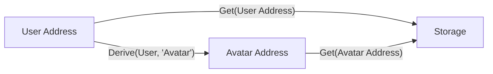
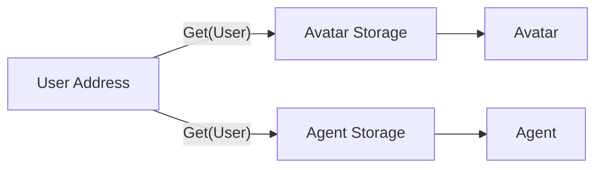

안녕하세요.  [Libplanet]의 네 번째 메이저 버전인 [4.0 버전][4.0]이
릴리스되었습니다.

Libplanet은 분산 P2P로 돌아가는 온라인 멀티플레이어 게임을 만들 때,
매번 구현해야 하는 P2P 통신이나 데이터 동기화 등의 문제를 푸는
공용 라이브러리입니다.

이번 버전부터 Libplanet은 상태를 조금 더 효율적으로 다루기 위해, 여러 [Account]
를 다룰 수 있는 [World] 를 도입하였고, 버전 마이그레이션을 큰 문제 없이 할 수 있도록
여러 API를 제공하고 있습니다.

이 글에서는 4.0 버전의 주요 변경 사항들에 대해서 다루겠습니다.

[Libplanet]: https://libplanet.io/
[4.0]: https://github.com/planetarium/libplanet/releases/tag/4.0.0
[Account]: https://docs.libplanet.io/4.1.0/api/Libplanet.Action.State.Account.html
[World]: https://docs.libplanet.io/4.1.0/api/Libplanet.Action.State.World.html

여러 Sub-state 를 들 수 있게 된 Libplanet
--------------------------------------------

그동안 Libplanet 은 단 하나의 상태 저장소 만을 가질 수 있었습니다. 이는 초기 개발에는 복잡한
`Sub-state` 유도 과정 등을 생략하고, 하나의 공유 데이터를 사용함으로써 많은 이점을 가질 수 있었습니다.

하지만 게임의 규모가 커짐에 따라, 한 Address 가 여러 상태 모델을 가지고 싶어하는 상황이 생겼습니다.
Libplanet 은 그동안 해당 Address 로부터 유도 된 새로운 Address 에 모델을 저장하는 방식을 채택하였습니다.
그래프로 그리면 다음과 같습니다.



이는 한 스토리지에 여러 데이터를 저장하게 되어 성능이나 권한 문제에서 자유로울 수 없었습니다.

이런 문제를 해결하기 위해, Libplanet 은 기존의 하나 밖에 없던 [`Account`]를
[`World.Legacy`] 로 만들고, [`World`] 밑에 여러 [`Account`] 를 가질 수 있게 하였습니다.



이런 문제로, 이전과 같이 직접적으로 [`IActionContext.PreviousState`] 혹은
[`IActionEvaluation.OutputState`]로부터 데이터를 읽어 올 수는 없습니다. 따라서
[`IAction.Execute()`]안에서의 API 는 다음과 같이 변경됩니다.

```csharp
IWorld world = context.PreviousState
IAccount avatarAccount = world.GetAccount(new Address("0x0000000000000000"))
IValue avatarList = avatarAccount.GetState(context.Signer)

IAccount agentAccount = world.GetAccount(new Address("0x0000000000000001"))
IValue agent = agentAccount.GetState(context.Signer)
```

각 도메인에 맞는 `Account` 를 가져오는 점에 주의하십시오.

[`Account`]: https://docs.libplanet.io/3.6.0/api/Libplanet.Action.State.Account.html
[`World.Legacy`]: https://docs.libplanet.io/4.1.0/api/Libplanet.Action.State.IWorldState.html#Libplanet_Action_State_IWorldState_Legacy
[`World`]: https://docs.libplanet.io/4.1.0/api/Libplanet.Action.State.IWorld.html
[`IActionContext.PreviousState`]: https://docs.libplanet.io/4.1.0/api/Libplanet.Action.IActionContext.html#Libplanet_Action_IActionContext_PreviousState
[`IActionEvaluation.OutputState`]: https://docs.libplanet.io/4.1.0/api/Libplanet.Action.IActionEvaluation.html#Libplanet_Action_IActionEvaluation_OutputState
[`IAction.Execute()`]: https://docs.libplanet.io/4.1.0/api/Libplanet.Action.IAction.html#Libplanet_Action_IAction_Execute_Libplanet_Action_IActionContext_

그 외
----

그 외에도 여러 성능 개선이나 자잘한 마이너 패치가 있었습니다. 자세한 내용은 [전체 변경 내용] 에서 확인해 주세요.

질문이나 관심이 있으신 분들은 또한 저희 [Discord] 채널에 놀러와 주세요!

[전체 변경 내용]: https://github.com/planetarium/libplanet/releases/tag/4.0.0
[Discord]: https://discord.gg/YaHPjcrdrw
